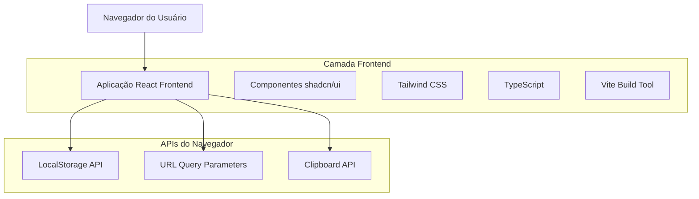
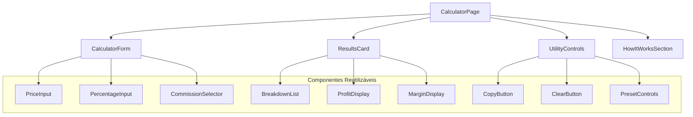
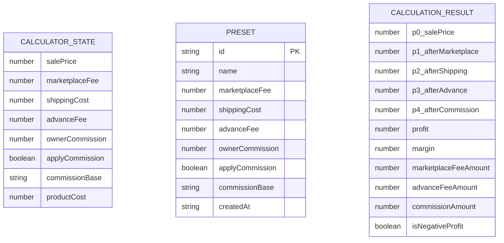

# Documento de Arquitetura Técnica - Calculadora de Venda DEBAJEYU ML

## 1. Design da Arquitetura



## 2. Descrição da Tecnologia

- Frontend: React@18 + TypeScript@5 + Vite@5 + Tailwind CSS@3 + shadcn/ui
- Backend: Nenhum (aplicação frontend pura)
- Armazenamento: LocalStorage (presets) + URL Query Parameters (compartilhamento)
- Testes: Vitest + React Testing Library

## 3. Definições de Rotas

| Rota | Propósito |
|------|-----------|
| / | Página principal da calculadora com todos os formulários e resultados |
| /?preco=250&taxa_ml=16.8&frete=22&antecipacao=3.8&custo=85 | Página principal com parâmetros pré-preenchidos para compartilhamento |

## 4. Definições de API

### 4.1 Tipos TypeScript Principais

```typescript
// Tipos de entrada da calculadora
interface CalculatorInput {
  salePrice: number;
  marketplaceFee: number; // percentual
  shippingCost: number;
  advanceFee: number; // percentual
  ownerCommission: number; // percentual
  applyCommission: boolean;
  commissionBase: 'gross' | 'post-advance';
  productCost: number;
}

// Resultado dos cálculos
interface CalculationResult {
  p0_salePrice: number;
  p1_afterMarketplace: number;
  p2_afterShipping: number;
  p3_afterAdvance: number;
  p4_afterCommission: number;
  profit: number;
  margin: number;
  marketplaceFeeAmount: number;
  advanceFeeAmount: number;
  commissionAmount: number;
  isNegativeProfit: boolean;
}

// Preset salvo no localStorage
interface CalculatorPreset {
  id: string;
  name: string;
  marketplaceFee: number;
  shippingCost: number;
  advanceFee: number;
  ownerCommission: number;
  applyCommission: boolean;
  commissionBase: 'gross' | 'post-advance';
  createdAt: string;
}
```

### 4.2 Funções Principais

**Função de Cálculo Principal**
```typescript
function calculateProfitAndMargin(input: CalculatorInput): CalculationResult
```

**Parâmetros de Entrada:**
| Nome do Parâmetro | Tipo | Obrigatório | Descrição |
|-------------------|------|-------------|-----------|
| salePrice | number | true | Preço de venda em reais |
| marketplaceFee | number | true | Taxa do marketplace em percentual |
| shippingCost | number | true | Custo do frete em reais |
| advanceFee | number | true | Taxa de antecipação em percentual |
| ownerCommission | number | true | Comissão do dono da conta em percentual |
| applyCommission | boolean | true | Se deve aplicar a comissão |
| commissionBase | string | true | Base da comissão: 'gross' ou 'post-advance' |
| productCost | number | true | Custo do produto em reais |

**Resposta:**
| Nome do Parâmetro | Tipo | Descrição |
|-------------------|------|-----------|
| profit | number | Lucro calculado em reais |
| margin | number | Margem de lucro em percentual |
| isNegativeProfit | boolean | Indica se o lucro é negativo |

**Exemplo de Entrada:**
```json
{
  "salePrice": 250.00,
  "marketplaceFee": 16.8,
  "shippingCost": 22.00,
  "advanceFee": 3.8,
  "ownerCommission": 4.0,
  "applyCommission": false,
  "commissionBase": "gross",
  "productCost": 85.00
}
```

**Exemplo de Resposta:**
```json
{
  "p0_salePrice": 250.00,
  "p1_afterMarketplace": 208.00,
  "p2_afterShipping": 186.00,
  "p3_afterAdvance": 178.93,
  "p4_afterCommission": 178.93,
  "profit": 93.93,
  "margin": 37.57,
  "marketplaceFeeAmount": 42.00,
  "advanceFeeAmount": 7.07,
  "commissionAmount": 0.00,
  "isNegativeProfit": false
}
```

## 5. Estrutura de Componentes



## 6. Modelo de Dados

### 6.1 Definição do Modelo de Dados



### 6.2 Armazenamento LocalStorage

**Estrutura de Presets no LocalStorage:**
```typescript
// Chave: 'calculadora-ml-presets'
interface StoredPresets {
  presets: CalculatorPreset[];
  lastUpdated: string;
}
```

**Exemplo de Dados Armazenados:**
```json
{
  "presets": [
    {
      "id": "preset-1",
      "name": "Loja Principal",
      "marketplaceFee": 16.8,
      "shippingCost": 22.00,
      "advanceFee": 3.8,
      "ownerCommission": 4.0,
      "applyCommission": true,
      "commissionBase": "gross",
      "createdAt": "2024-01-15T10:30:00Z"
    }
  ],
  "lastUpdated": "2024-01-15T10:30:00Z"
}
```

**Estrutura de Query Parameters para Compartilhamento:**
```
/?preco=250.00&taxa_ml=16.8&frete=22.00&antecipacao=3.8&comissao=4.0&aplicar_comissao=false&base_comissao=gross&custo=85.00
```