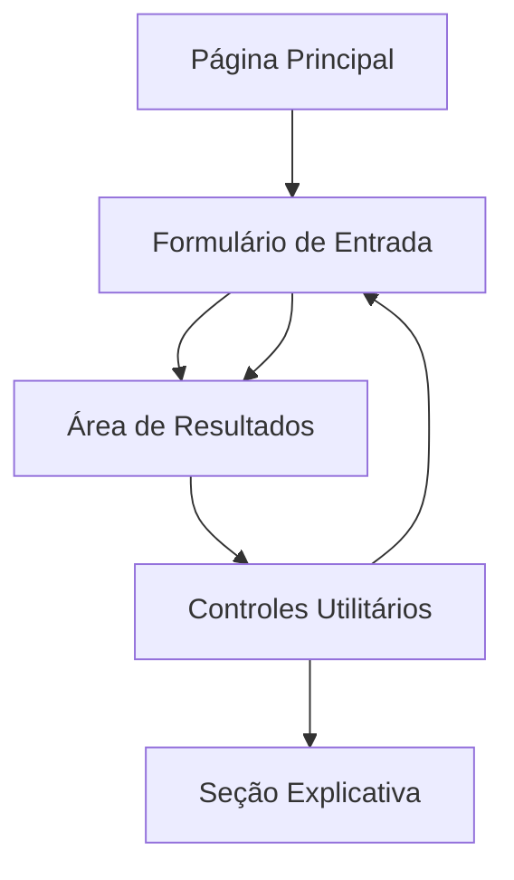

# Documento de Requisitos do Produto - Calculadora de Venda DEBAJEYU ML

## 1. Visão Geral do Produto

Uma aplicação web SPA (Single Page Application) responsiva para calcular lucro e margem de vendas no Mercado Livre, permitindo análise em tempo real de diferentes cenários de preço, taxas e custos com campos editáveis e resultados instantâneos.

O produto resolve a necessidade de vendedores do Mercado Livre calcularem rapidamente a rentabilidade de seus produtos considerando todas as taxas e deduções específicas da plataforma, oferecendo flexibilidade para diferentes modelos de comissão e permitindo salvar configurações personalizadas.

Destinado a vendedores individuais e pequenas empresas que precisam de uma ferramenta ágil e precisa para análise de margem de lucro em vendas online.

## 2. Funcionalidades Principais

### 2.1 Papéis de Usuário

Não há distinção de papéis de usuário - todos os usuários têm acesso completo às funcionalidades da calculadora.

### 2.2 Módulo de Funcionalidades

Nossa calculadora de venda consiste nas seguintes páginas principais:

1. **Página Principal**: formulário de entrada de dados, área de resultados, controles utilitários, seção explicativa das fórmulas.

### 2.3 Detalhes das Páginas

| Nome da Página | Nome do Módulo | Descrição da Funcionalidade |
|----------------|----------------|------------------------------|
| Página Principal | Formulário de Entrada | Capturar preço de venda, taxa marketplace (16,8% padrão), frete (R$ 22,00 padrão), taxa antecipação (3,8% padrão), comissão dono conta (4% padrão), seletor aplicar comissão, base da comissão (radio buttons), custo do produto. Todos com máscara BRL/PT-BR e validação |
| Página Principal | Área de Resultados | Exibir resumo passo a passo (P0→P4), breakdown detalhado das deduções, lucro em destaque, margem percentual, badges indicativos da base de comissão |
| Página Principal | Controles Utilitários | Botões copiar resumo, limpar campos, salvar preset no localStorage, carregar preset via dropdown, compartilhamento via querystring na URL |
| Página Principal | Seção Explicativa | Accordion/tooltip "Como calculamos?" com fórmulas detalhadas do processo de cálculo |

## 3. Processo Principal

O usuário acessa a página e visualiza um formulário com campos pré-preenchidos com valores padrão. Ao inserir ou modificar qualquer valor, os cálculos são atualizados instantaneamente na área de resultados.

**Fluxo Principal:**
1. Usuário insere preço de venda e custo do produto (campos obrigatórios)
2. Ajusta taxas conforme necessário (marketplace, frete, antecipação)
3. Define se aplicará comissão de 4% e sua base de cálculo
4. Visualiza resultados em tempo real com breakdown detalhado
5. Pode copiar resumo, salvar configuração como preset ou compartilhar via URL

**Fluxo de Cálculo:**
- P0 = Preço de venda
- P1 = P0 - (Taxa marketplace% × P0)
- P2 = P1 - Frete
- P3 = P2 - (Taxa antecipação% × P2)
- P4 = P3 - Comissão 4% (se aplicável, sobre P0 ou P3)
- Lucro = P4 - Custo do produto
- Margem = (Lucro ÷ P0) × 100

## 4. Design da Interface do Usuário

### 4.1 Estilo de Design

- **Cores Primárias**: Azul (#3B82F6) para elementos principais, Verde (#10B981) para lucros positivos, Vermelho (#EF4444) para alertas
- **Cores Secundárias**: Cinza (#6B7280) para textos secundários, Branco (#FFFFFF) para fundos de cards
- **Estilo de Botões**: Arredondados com sombra sutil, estados hover e focus bem definidos
- **Tipografia**: Inter ou similar, tamanhos 14px para textos, 16px para inputs, 24px+ para destaques
- **Layout**: Card-based com grid responsivo, navegação superior limpa
- **Ícones**: Lucide React ou Heroicons, estilo outline, tamanho 20px padrão

### 4.2 Visão Geral do Design das Páginas

| Nome da Página | Nome do Módulo | Elementos da UI |
|----------------|----------------|-----------------|
| Página Principal | Header | Título "Calculadora de Venda – DEBAJEYU ML", fundo gradiente azul, tipografia bold 28px |
| Página Principal | Card de Entradas | Formulário em grid 2 colunas (desktop), inputs com labels claras, máscaras BRL, validação visual, select/radio estilizados |
| Página Principal | Card de Resultados | Background claro, breakdown em lista vertical, valores monetários destacados, badges coloridos, lucro em fonte 32px bold |
| Página Principal | Controles Utilitários | Botões secundários alinhados horizontalmente, ícones descritivos, tooltips explicativos |
| Página Principal | Seção Explicativa | Accordion colapsível, fórmulas em código monospace, exemplos práticos |

### 4.3 Responsividade

Produto mobile-first com breakpoints em 768px (tablet) e 1024px (desktop). No mobile, cards ficam empilhados verticalmente. Inputs e botões têm tamanho mínimo de 44px para touch. Navegação por teclado completa com indicadores visuais de foco.

## 5. Validações e Casos de Teste

**Caso de Teste Principal:**
- Preço de venda: R$ 250,00
- Taxa marketplace: 16,8%
- Frete: R$ 22,00
- Taxa antecipação: 3,8%
- Sem comissão 4%
- Custo: R$ 85,00
- **Resultado esperado:** Lucro ≈ R$ 93,93 | Margem ≈ 37,57%

**Validações:**
- Campos monetários ≥ R$ 0,00
- Campos percentuais entre 0% e 100%
- Alerta "Lucro negativo" quando custo > subtotal
- Formatação automática BRL (R$ 0.000,00)
- Arredondamento para 2 casas decimais na exibição